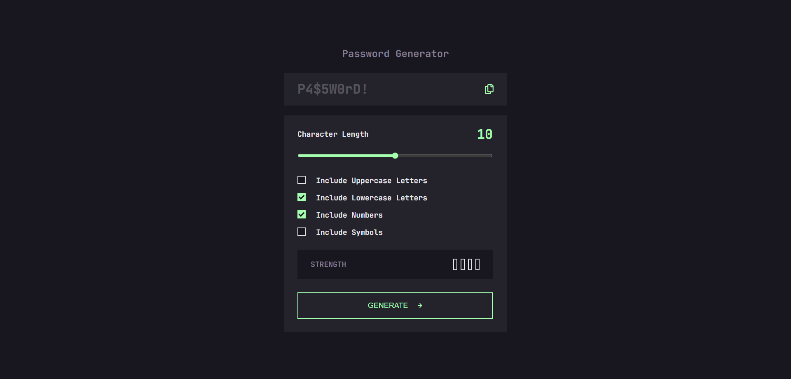
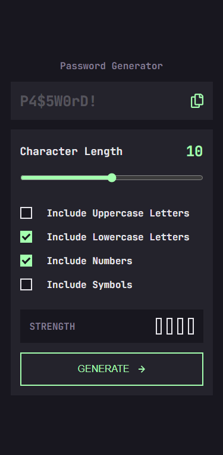

# Frontend Mentor - Password generator app solution

This is a solution to the [Password generator app challenge on Frontend Mentor](https://www.frontendmentor.io/challenges/password-generator-app-Mr8CLycqjh). Frontend Mentor challenges help you improve your coding skills by building realistic projects.

## Table of contents

- [Overview](#overview)
  - [The challenge](#the-challenge)
  - [Screenshot](#screenshot)
  - [Links](#links)
- [My process](#my-process)
  - [Built with](#built-with)
  - [What I learned](#what-i-learned)
  - [Continued development](#continued-development)
  - [Useful resources](#useful-resources)
- [Author](#author)
- [Acknowledgments](#acknowledgments)

**Note: Delete this note and update the table of contents based on what sections you keep.**

## Overview

### The challenge

Users should be able to:

- Generate a password based on the selected inclusion options
- Copy the generated password to the computer's clipboard
- See a strength rating for their generated password
- View the optimal layout for the interface depending on their device's screen size
- See hover and focus states for all interactive elements on the page

### Screenshot

### Links

- Solution URL: [https://github.com/Darko96/calculator]
- Live Site URL: [https://darko96.github.io/calculator/]

## My process

### Built with

- Semantic HTML5 markup
- CSS custom properties
- Flexbox
- React
- useState
- useEffect
- Desktop-first workflow

**Note: These are just examples. Delete this note and replace the list above with your own choices**

### What I learned

I learned how to manage an app with multiple checkboxes and with input field, where everything works together and depends and each other.

### Continued development

I'll keep practising react, expecialy react hooks: useState, useEffect, useReducer...

### Useful resources

- [A Complete Guide to Grid](https://css-tricks.com/snippets/css/complete-guide-grid/) - This helped me a lot ot understand CSS Grid.
- [A Complete Guide to Flexbox](https://css-tricks.com/snippets/css/a-guide-to-flexbox/) - This helped me a lot ot understand flex-box.
- [A Complete Guide to CSS Media Queries](https://css-tricks.com/a-complete-guide-to-css-media-queries/) - This helped me a lot to understand media queries.
- [JavaScript MDN Documentation](https://developer.mozilla.org/en-US/docs/Web/JavaScript) - This helped me a lot to understand javascript and DOM.
- [React Documentation](https://react.dev/learn) - It is such a nice documentation for begginers.
- [React Course](https://www.udemy.com/course/the-ultimate-react-course/) - Best React course if you ask me.

## Author

- Portfolio [Darko Mijatovic](https://darko96.github.io/portfolio/)
- LinkedIn - [Darko Mijatovic](https://www.linkedin.com/in/darko-mijatovic-512384231/)
- Frontend Mentor - [@Darko96](https://www.frontendmentor.io/profile/Darko96)
- Instagram - [darkomiijatovic](https://www.instagram.com/darkomiijatovic/)

## Acknowledgments

I want to thank a lot to everyone in Frontend Mentor team. Because they made an awesome website where we can practice what we learn.

Thank you so much for checking my project and Any feedback is highly appreciated.
